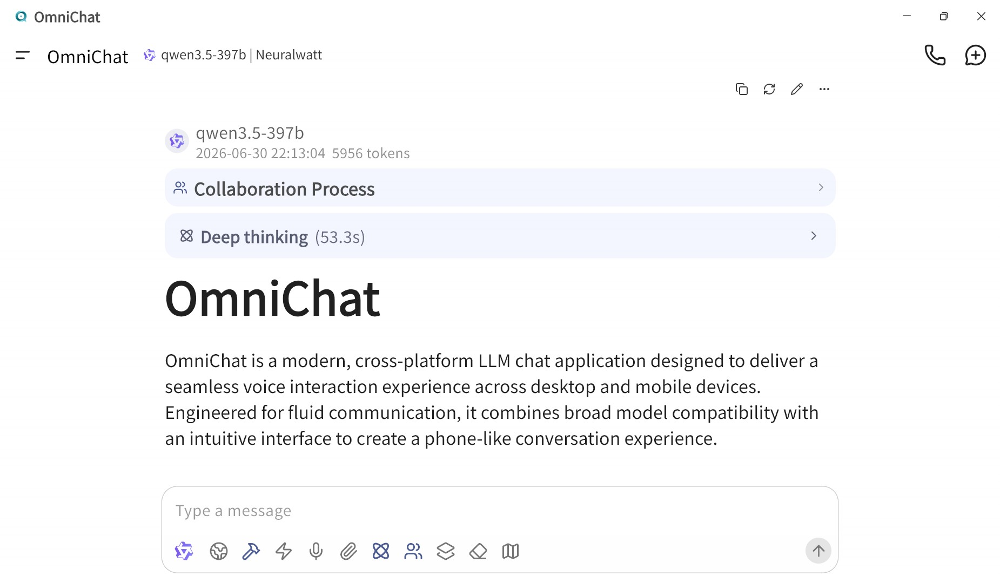
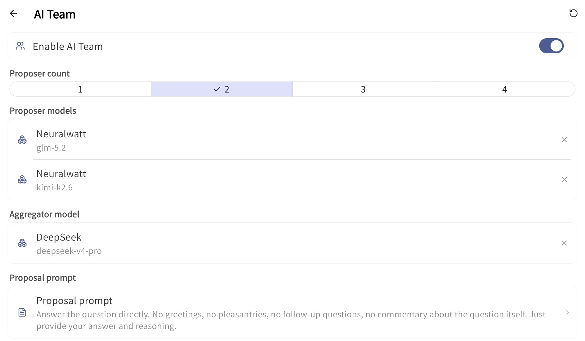
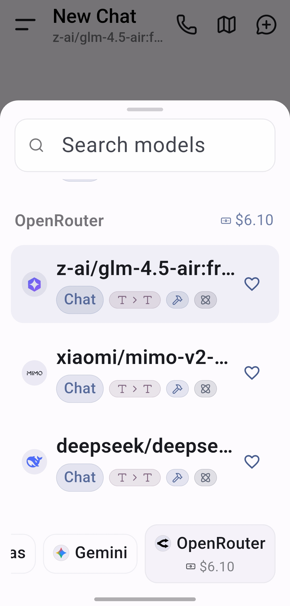

# OmniChat

> Cross-Platform LLM Chat Application with AI Team

English | [繁體中文](README_ZH_TW.MD)

OmniChat is a modern AI chat application designed for seamless voice interaction and a unified cross-platform experience.

## Key Features

### AI Team (Mixture of Agents)

Supports two advanced multi-agent collaboration pipelines for complex problem solving:
- **Parallel (MoA)**: Orchestrate 1–4 "proposer" models to explore a question independently, then let an "aggregator" model synthesize their perspectives into a single, comprehensive response.
- **Chain (CMoA)**: Sequential reasoning chain (Proposer -> Self-Audit Critics 0~3 -> Aggregator). Critics apply 7 Analytical Lenses (Adversarial, Causal/Structural, Comparative, Temporal, etc.) to stress-test and audit preceding outputs.
- **Real-Time Streaming**: Proposals and audit logs stream live as each model completes, rendered in clean, layered collapsible sections.

### Deep Research

Preset agent protocol designed for complex scientific, technical, and investigative research:
- **Dual Think & Search Engine**: Combines multi-round deep reasoning with real-time web search. Uses targeted search queries to resolve uncertainties and fuels subsequent reasoning loops.
- **Epistemic Discipline**: Enforces a strict distinction between *Evidence* (empirical facts), *Inference* (logical deductions), and *Judgment* (value choices).
- **Rigorous Synthesis**: Dynamic stopping criteria based on information saturation, producing decision-useful research reports backed by verifiable citations and epistemic calibration.

### Advanced Web Search

Integrated Tinyfish Search API, Google Search API, and multiple search providers for high-quality real-time information.

### Real-Time Voice Chat

Experience AI interaction as natural as a phone call:

- **Universal Model Support**: Connect with your preferred LLM backends.
- **Bluetooth Optimization**: Enhanced headset detection and audio routing in Call Mode.
- **Native Performance**: Utilizes system-level Speech-to-Text (STT) for low latency.

### Account Balance Monitoring

**Real-Time Tracking**: Keep track of your usage effortlessly. Account balance is now displayed directly within the Model Selection menu and Provider Settings.

### Advanced Interaction & Tools

- **Inline Voice Dictation**: Dictate text directly into the chat input bar with localized support for English and Chinese.
- **Local JavaScript MCP**: Secure, sandboxed environment (QuickJS/JavaScriptCore) allowing AI to execute code locally for calculations and data processing.

### UI/UX Optimization

- **Refined Interface**: Optimized icon sizes in the chat input bar and model selector to improve touch targets and overall accessibility.

## Cross-Platform Support

Enjoy a consistent experience across your devices:

- **Windows** (New!)
- **Android**

## Screenshots

  
  

