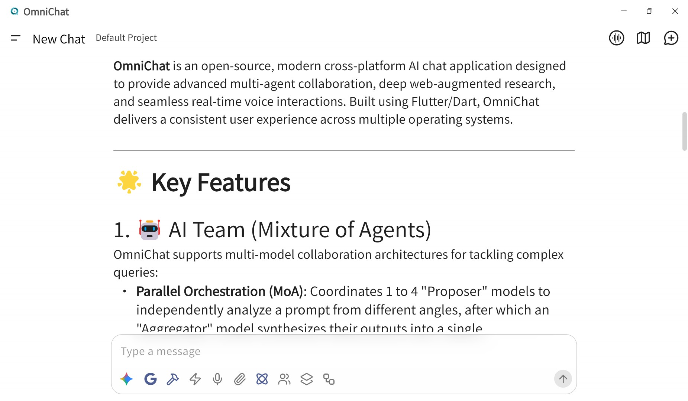
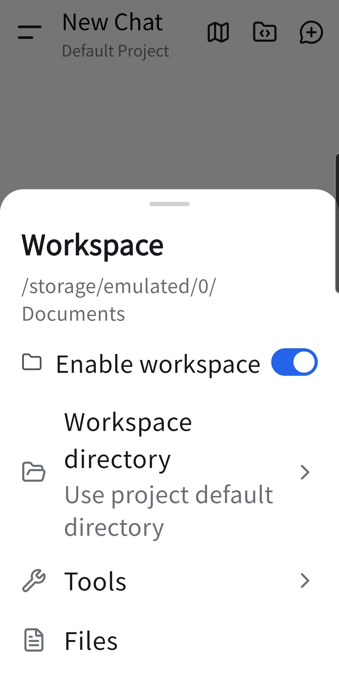
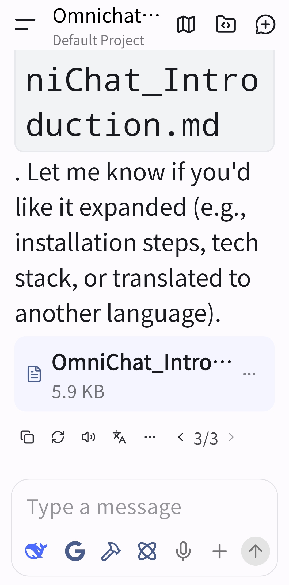
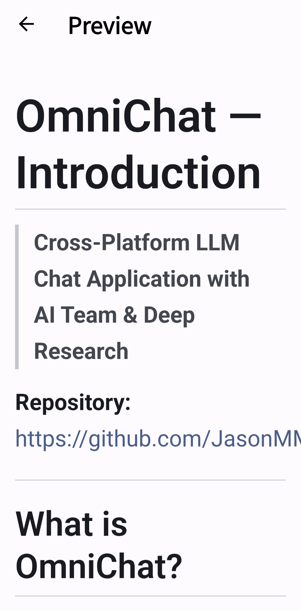
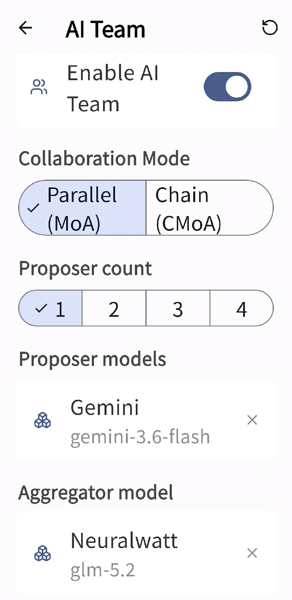
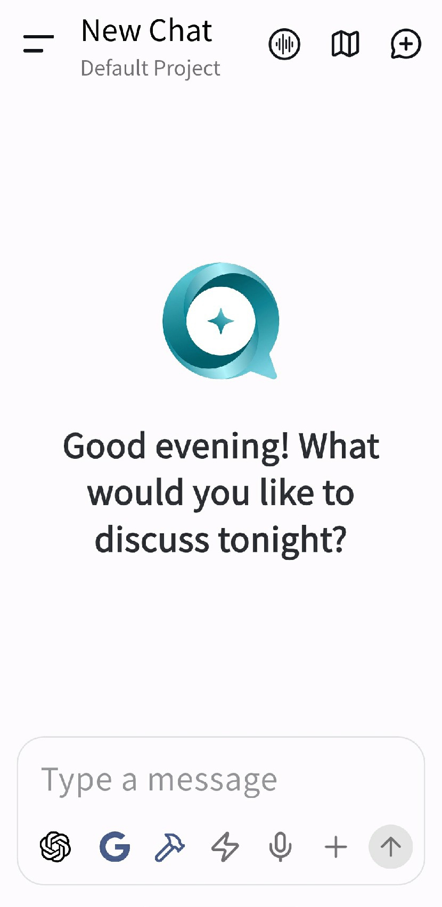
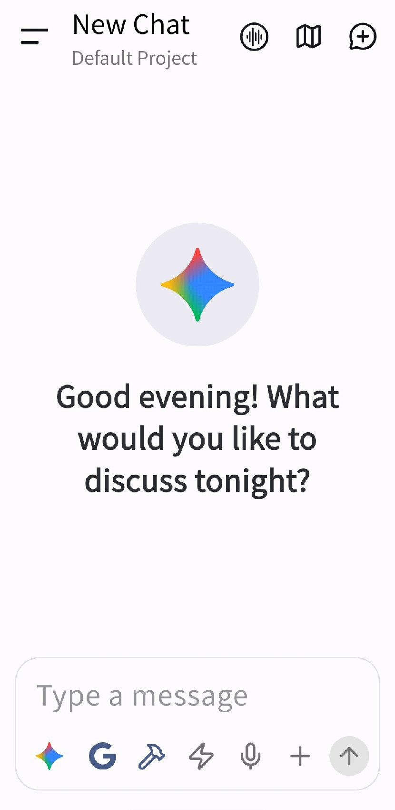
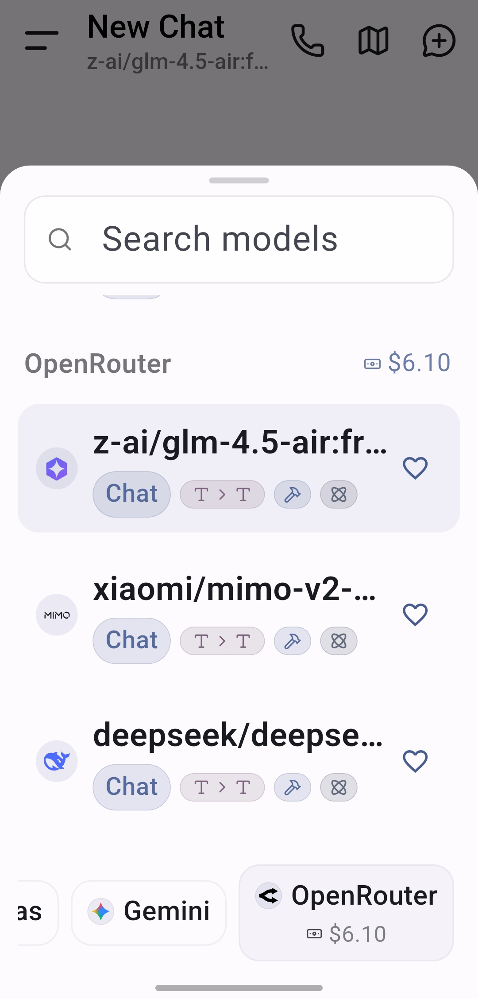

# OmniChat

> Cross-Platform LLM Chat Application with abundant features

English | [繁體中文](README_ZH_TW.MD)

---

  

OmniChat is a modern, feature-rich AI chat application designed for text file editing,  deep research, multi-agent collaboration, seamless voice interaction, and a unified cross-platform experience.

## ✨ Key Features

### 📁 Workspace

Give the AI direct access to your files — everything happens inside a folder you choose, safely sandboxed:

- **Flexible Setup**: Choose a global default folder, set a workspace per project, or override it for a single conversation.
- **File Management**: Ask the AI to read, create, edit, delete, move, copy, search, or unzip files inside your chosen folder.
- **Reads Common File Formats**: Reads common formats inside your workspace, including TXT, MD, HTML, CSV, SVG, JSON, XML, YAML, DOCX, XLSX, PPTX, and PDF.
- **Create Documents, Slides, Reports, Charts & PDFs**: Supports TXT, MD, HTML, CSV, SVG, PDF, and more (DOCX, XLSX, PPTX not yet supported).

  
  
  

---

### 🤖 AI Team (Mixture of Agents)

Supports two advanced multi-agent collaboration pipelines for complex problem solving:

- **Parallel (MoA)**: Orchestrate 1–4 "proposer" models to explore a question independently, then let an "aggregator" model synthesize their perspectives into a single, comprehensive response.
- **Chain (CMoA)**: Sequential reasoning chain (Proposer -> Self-Audit Critics 0~3 -> Aggregator). Critics apply 7 Analytical Lenses (Adversarial, Causal/Structural, Comparative, Temporal, etc.) to stress-test and audit preceding outputs.
- **Real-Time Streaming**: Proposals and audit logs stream live as each model completes, rendered in clean, layered collapsible sections.

  

---

### 🎨 Customizable New Chat Empty State & Dynamic AI Greetings

Personalize your empty chat screen with zero-latency greetings and branding:

- **Flexible Logo & Icon Display**: Choose between OmniChat logo, active model icon, custom uploaded image, or hidden logo.
- **Zero-Latency AI Dynamic Greetings**: Pre-caches AI-generated warm greetings in the background upon app start for instant display.
- **Dedicated Greeting Model & Prompts**: Independently select the model for greeting generation, customize prompts, and toggle thinking budget (Enable Thinking).
- **Refined Visual Layout**: Enlarged logo aesthetics (100px) and bold typography for a modern, premium feel.

  
  

---

### 🎙️ Real-Time Voice Chat

Experience AI interaction as natural as a phone call:

- **Universal Model Support**: Connect with your preferred LLM backends.
- **Bluetooth Optimization**: Enhanced headset detection and audio routing in Call Mode.
- **Native Performance**: Utilizes system-level Speech-to-Text (STT) for low latency.

  

---

### 💳 Account Balance Monitoring

Keep track of your usage effortlessly. Real-time account balance is displayed directly within the Model Selection menu and Provider Settings (supports OpenAI, Gemini, DeepSeek, OpenRouter, Neuralwatt, and more).

  

---

### 🔬 Deep Research

Preset agent protocol designed for complex scientific, technical, and investigative research:

- **Dual Think & Search Engine**: Combines multi-round deep reasoning with real-time web search. Uses targeted search queries to resolve uncertainties and fuels subsequent reasoning loops.
- **Epistemic Discipline**: Enforces a strict distinction between *Evidence* (empirical facts), *Inference* (logical deductions), and *Judgment* (value choices).
- **Rigorous Synthesis**: Dynamic stopping criteria based on information saturation, producing decision-useful research reports backed by verifiable citations and epistemic calibration.

---

### 📚 Academic Search

Built-in free academic search providers for scholarly literature, fully integrated into the search service:

- **arXiv**: Search preprints through the official arXiv API — no API key or registration required, with automatic rate-limit throttling (one request every 3 seconds).
- **PubMed (E-utilities)**: Two-step esearch → efetch flow returns paper titles and abstracts from NCBI.
- **Semantic Scholar**: Paper search via the Academic Graph API with graceful rate-limit messaging.

All three providers work out of the box; PubMed and Semantic Scholar accept an optional API key to raise their rate limits. Official brand icons are displayed across all UI surfaces (mobile & desktop).

---

### 🌐 Advanced Web Search & Local MCP Tools

- **Advanced Web Search**: Integrated Tinyfish Search API, Google Search API, and multiple search providers for high-quality real-time information.
- **Inline Voice Dictation**: Dictate text directly into the chat input bar with localized support for English and Chinese.
- **Local JavaScript MCP**: Secure, sandboxed environment (QuickJS/JavaScriptCore) allowing AI to execute code locally for calculations and data processing.

---

### 🛠️ Customizable Input Bar Buttons

Tailor the chat input bar tools to your workflow — one shared layout for mobile and desktop:

- **Drag to Reorder**: Rearrange input bar buttons (model selector, web search, MCP, quick phrases, dictation, camera/photos, file upload, reasoning, AI Team, instruction injection, voice chat, context management, OCR) in **Settings → Display Settings → Input Bar Buttons**.
- **Show/Hide Toggles**: Hide rarely used buttons entirely; platform-specific buttons (camera/photos on mobile, file upload/OCR on desktop) are only shown where available.
- **One-Tap Reset**: Restore the default order and visibility anytime.

---

## 💻 Cross-Platform Support

Enjoy a consistent experience across your devices:

- **Windows**
- **Android**

---

## 📄 License & Acknowledgements

OmniChat is a fork of [Kelivo](https://github.com/Chevey339/kelivo) — an AGPL-3.0-licensed Flutter LLM chat client by [Chevey339](https://github.com/Chevey339), with UI design inspired by RikkaHub.

OmniChat is distributed under the [GNU Affero General Public License v3.0](LICENSE), the same license as its upstream project. In accordance with the AGPL-3.0, the original copyright of the upstream code is retained.
