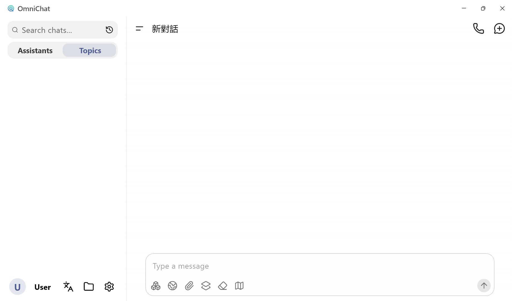
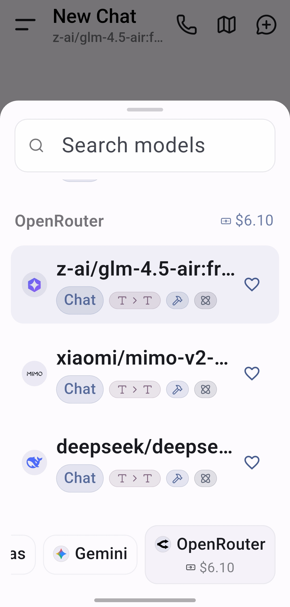

# OmniChat

> 支援即時語音對話的跨平台 LLM 聊天應用程式

[English](README.md) | 繁體中文

OmniChat 是一款現代化的 AI 聊天軟體，專為流暢的語音互動與跨平台體驗而設計。

## 核心特色

### 即時語音聊天 (Real-time Voice Chat)

打造如同打電話般的 AI 對話體驗：

- **廣泛模型支援**：相容於各類 LLM 模型，選擇您偏好的 AI 助手。
- **聯網搜尋能力**：賦予 AI 即時存取網路資訊的能力。
- **藍牙通話模式**：針對藍牙耳機優化，支援通話模式 (Call Mode) 音訊路由，體驗更佳。
- **原生語音辨識**：整合系統原生 STT (Speech-to-Text) 引擎，辨識更精準快速。

### 帳戶餘額監控 (Account Balance Monitoring)

- **即時用量追蹤**：無需切換頁面，直接在「模型選擇選單」與「供應商設定」中查看剩餘額度，輕鬆掌握 API 使用狀況。

### 介面與體驗優化 (UI/UX Optimization)

- **操作體驗升級**：優化了聊天輸入欄與模型選擇器的圖示尺寸與佈局，提升觸控精確度與整體無障礙體驗。

## 跨平台支援

無論在桌面或行動裝置，享受一致的體驗：

- **Windows** (新支援)
- **Android**

## 建議

- 為了獲得最佳語音對話體驗，建議將 **系統提示詞 (System Prompt)** 設定為：「你正在進行語音對話，請使用口語化的文字，並保持對話簡單、清楚」。

- 搭配 Groq API 可獲得快速回應。

- 搭配 Gemini API 並啟用模型內建網路搜尋可較快速獲取即時資訊。

## 螢幕截圖

  
  

